# Uso de TolochaRadio Android

> [← Volver al README](../README.md)

TolochaRadio Android es el cliente móvil de tu instancia [TolochaRadio](https://github.com/izquierdojl/tolocharadio). Te permite explorar el catálogo global de emisoras, guardar favoritas, recuperar tu historial y escuchar en segundo plano o en Chromecast. Las credenciales se configuran **por servidor** y la sesión es automática: no verás pantallas de login.

  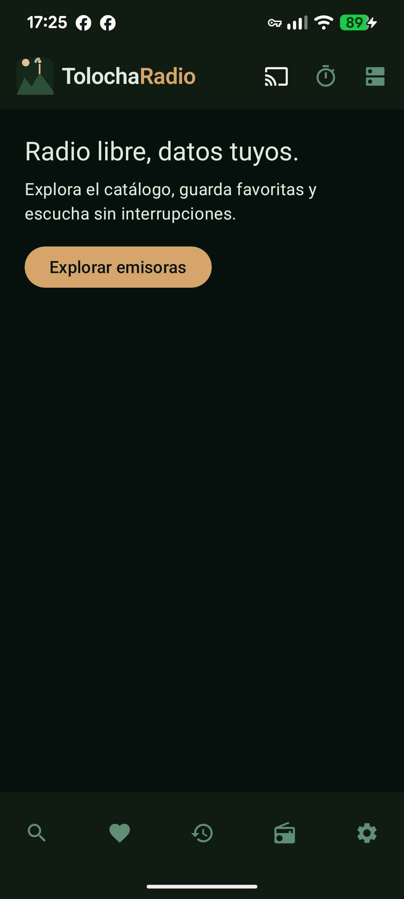

## Primer arranque

Al abrir la app por primera vez (o cuando no hay ningún servidor configurado) se muestra el formulario de **Añadir servidor**. Rellena:

- **URL del servidor**: por ejemplo `https://radio.mi-dominio.com`.
- **Alias**: un nombre corto para reconocerlo (`Casa`, `VPS`…).
- **Email de la cuenta**: el email con el que te registraste en la instancia.
- **Contraseña**: tu contraseña.

Al guardar, la app valida la URL y las credenciales y hace login automático. A partir de ahí, la sesión se mantiene y se renueva sola con el refresh rotatorio.

## Explorar el catálogo

Entra en **Explorar** para navegar por el catálogo de [RadioBrowser](https://www.radio-browser.info). Puedes:

- **Buscar por nombre** desde el campo de texto.
- Filtrar por **País**, **Idioma** y **Género** con los selectores.
- Alternar entre **vista de lista** y **vista de tarjetas** desde el icono superior.
- Marcar emisoras como favoritas con el corazón de cada fila.

Toca una emisora para abrir su **ficha**, con su carátula, país, idioma, etiquetas y el botón **Reproducir**.

| Explorar | Búsqueda |
| --- | --- |
| 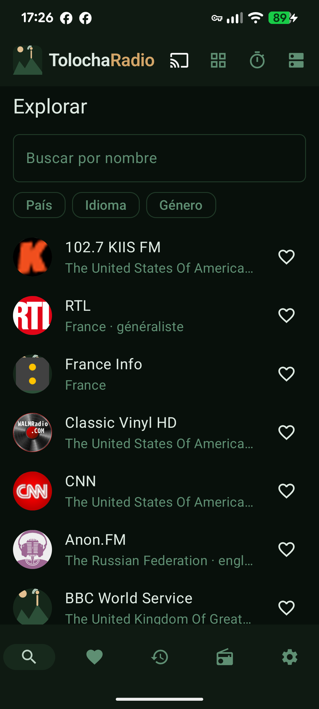 | 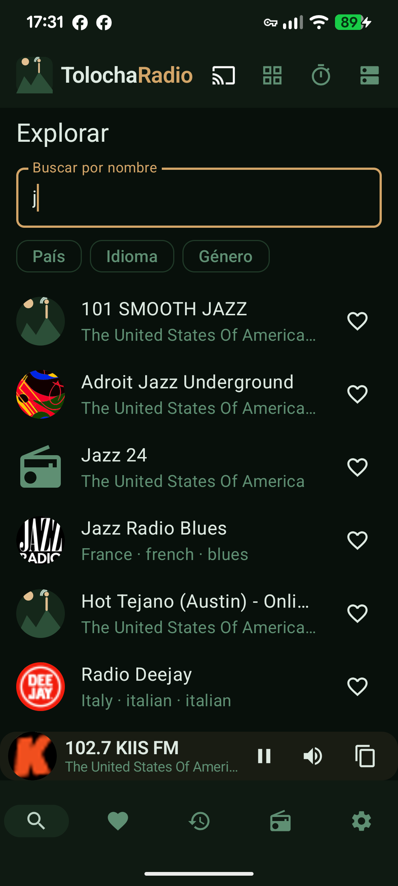 |

## Reproductor

El reproductor es **flotante y persistente**: la música sigue sonando al cambiar de sección. Desde la barra inferior puedes pausar/reanudar, **silenciar** y **copiar el enlace** del stream.

Toca la barra para abrir la **información de la emisora** (carátula, géneros, códec, bitrate, SSL, votos, clics y homepage). También dispone de:

- **Temporizador de apagado**: elige un tiempo y la reproducción se detiene sola.
- **Chromecast**: pulsa el icono de cast para enviar el audio a un dispositivo de la red.
- **Reproducción en segundo plano**: con la notificación multimedia y los controles de la pantalla de bloqueo.

| Ficha de emisora | Reproductor flotante | Información de la emisora |
| --- | --- | --- |
| 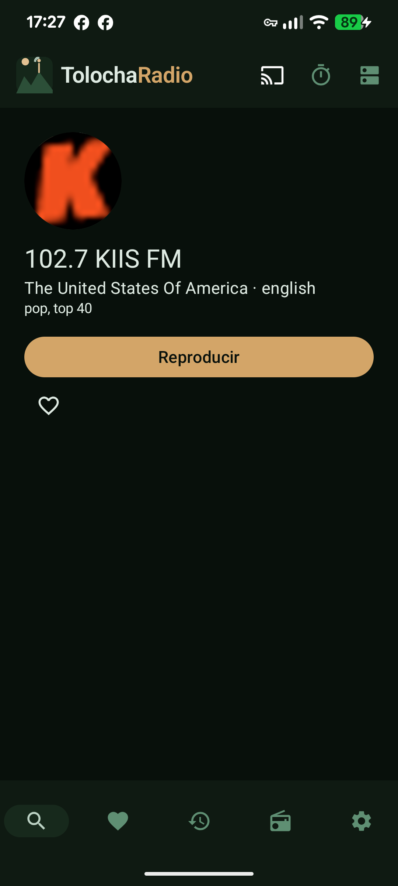 | 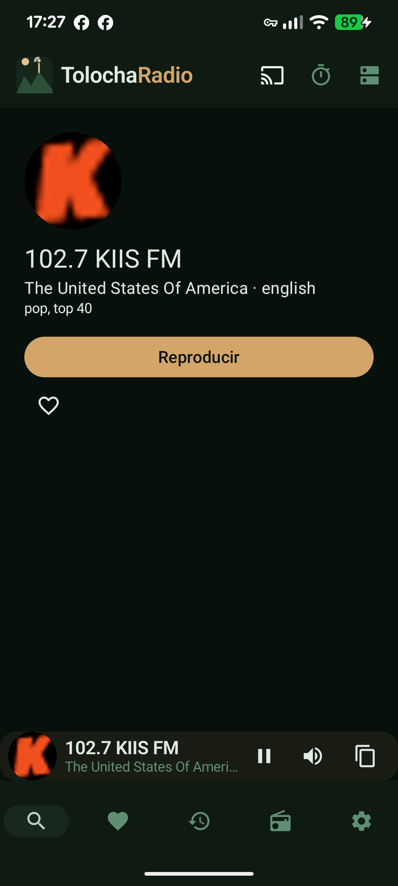 | 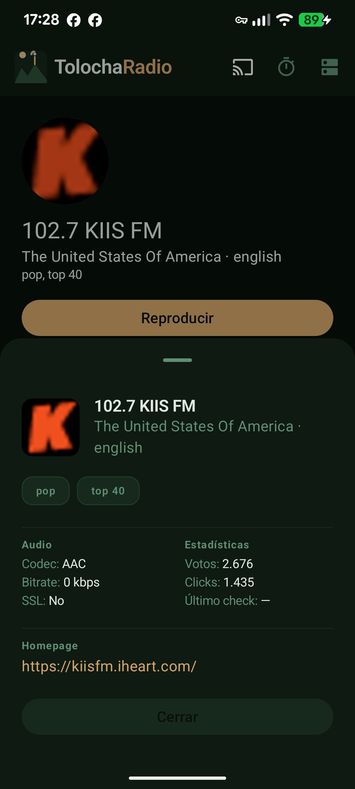 |

## Favoritos

En **Favoritos** tienes tu lista personal. Puedes:

- Reproducir cualquier emisora con un toque.
- **Reordenar** la lista arrastrando desde el asa de cada fila.
- **Quitar** una favorita con el corazón (la acción se puede deshacer).

Cada favorito guarda una copia de los datos de la emisora, así que la lista carga también sin conexión.

  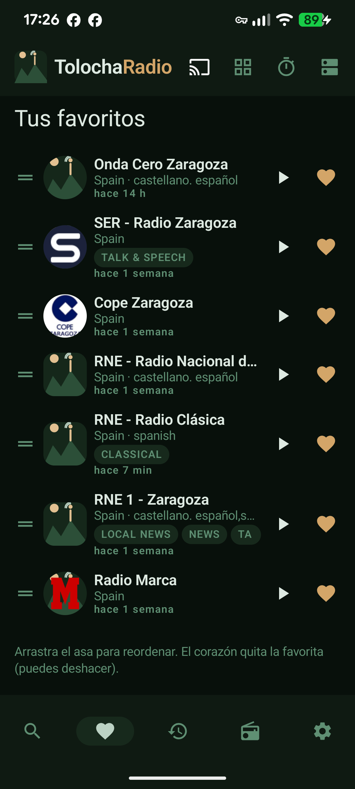

## Historial

En **Historial** aparece lo último que has escuchado, con la marca de tiempo relativa. Puedes volver a reproducir cualquier entrada o vaciar todo el historial con **Limpiar**.

  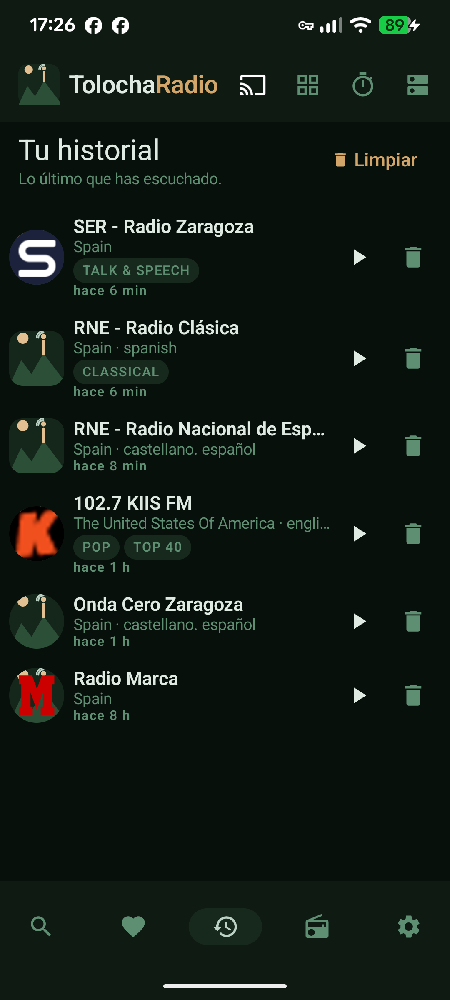

## Mis emisoras

**Mis emisoras** sirve para dar de alta emisoras que no están en el catálogo público. Introduce un **nombre** y la **URL del stream** y pulsa **Añadir**; aparecerán junto al catálogo y podrás reproducirlas o eliminarlas.

  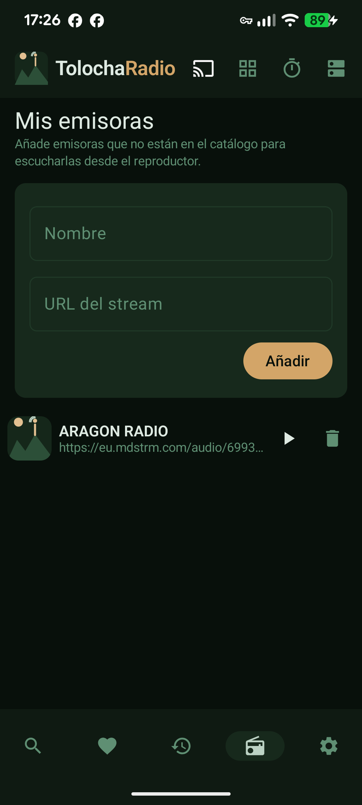

## Servidores

Desde el icono de **Servidores** (barra superior) gestionas tus instancias:

- **Cambiar de servidor activo**: toca una tarjeta.
- **Añadir** uno nuevo con el botón `+`.
- **Editar** la URL, el alias o las credenciales de un servidor (la contraseña se muestra enmascarada y solo se cambia si la escribes).
- **Eliminar** un servidor.

| Servidores | Añadir servidor |
| --- | --- |
| 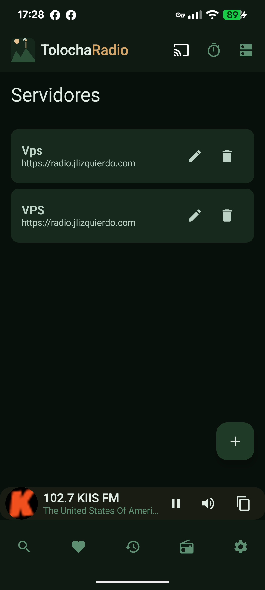 | 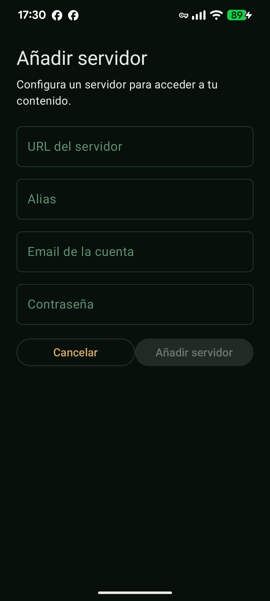 |

## Configuración

- **Tema**: Sistema, Oscuro o Claro.
- **Pantalla de arranque**: Favoritos, Historial o Explorar (con un servidor configurado).
- **Acerca de**: versión real, número de compilación, identificador, tipo de build, tema, pantalla de arranque, desarrollador y licencia; con enlace al repositorio y opción de copiar la información.

| Configuración | Acerca de |
| --- | --- |
| 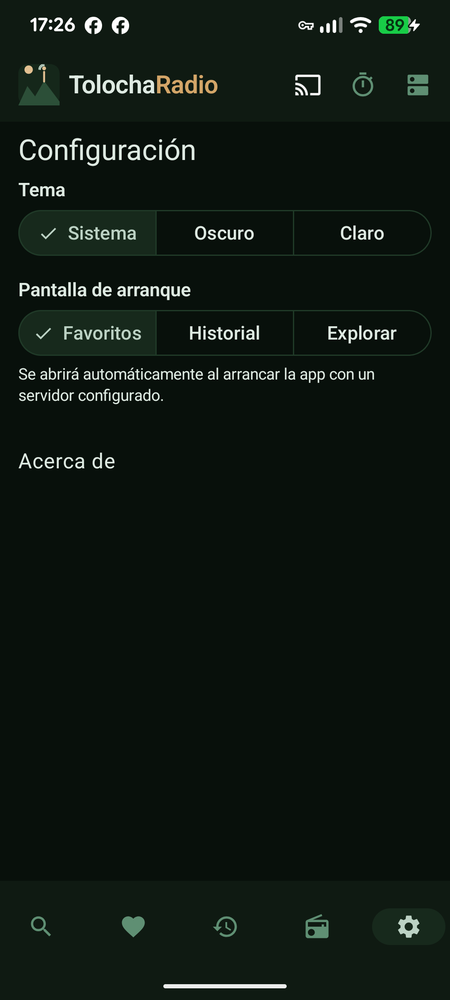 | 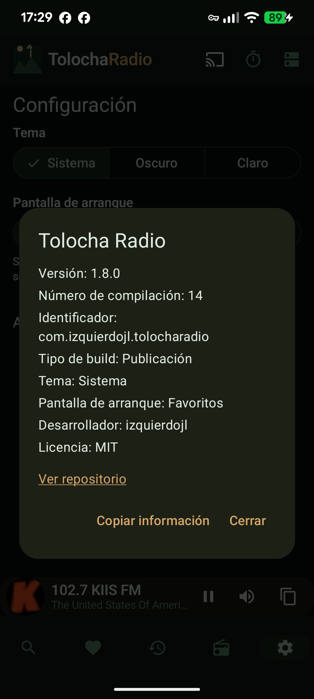 |

## Privacidad y autonomía

TolochaRadio Android es software libre y habla exclusivamente con **tus instancias**. No hay seguimiento ni intermediarios; las credenciales se guardan cifradas en el dispositivo y los tokens no se exponen en las URLs. La única dependencia externa es la base de datos pública de RadioBrowser para el catálogo.

## Referencia rápida

| Tema | Documento |
| --- | --- |
| Instalación y compilación | [docs/instalacion.md](instalacion.md) |
| Arquitectura y stack | [docs/arquitectura.md](arquitectura.md) |
| Desarrollo, tests y CI | [docs/desarrollo.md](desarrollo.md) |
| Releases y firma | [docs/RELEASE.md](RELEASE.md) |
| Licencia | [docs/licencia.md](licencia.md) |
